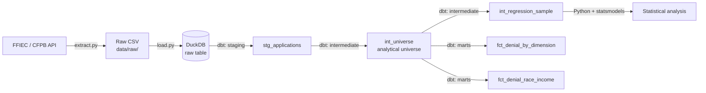

# HMDA Mortgage Denial Analysis

## Project Overview

This project looks at mortgage denial rates in North Carolina and asks how much of the racial gap in those rates can be accounted for by measurable financial factors, and how much remains after controlling for them. I pulled loan-level records from the government's public HMDA dataset, loaded them into DuckDB, cleaned and modeled them with dbt, and ran a staged logistic regression in Python to answer the question.

Denial rates are different across racial groups. Some of that difference comes from things like income, how big the loan is compared to the home's value, and how much debt the applicant already has. So the real question is: once you control for those financial factors, how much of the gap is left?

The observed gap remains substantial after those controls. Even after controlling for income, loan-to-value ratio, and debt-to-income ratio, Black applicants are still about 1.99 times more likely to be denied than White applicants with similar finances. Those financial factors only explain about 23% of the gap.

## Why This Project

Mortgage lending is a common industry where I live, and it's something I already had a connection to. My father worked in mortgage analysis, and he helped me understand what to actually look for in loan-level data, like which financial factors lenders care about and what a denial really means. I wanted to make something a bit more professional and clean than a school project.

## Architecture



The pipeline has five stages:

1. **Extract** (`extract.py`) - pulls the raw loan file from the FFIEC/CFPB API and saves it to `data/raw/`.
2. **Load** (`load.py`) - reads that raw file into DuckDB as-is, with no cleaning.
3. **Staging** (`stg_applications`) - casts fields to the right types and fixes column names, but doesn't drop any rows.
4. **Analytical universe** (`int_universe`, `int_regression_sample`) - applies the exclusions that define which applications belong in the analysis, plus a further-narrowed sample used specifically for the regression.
5. **Marts and analysis** - `fct_denial_by_dimension` and `fct_denial_race_income` are denial-rate rollups built from `int_universe`; the regression itself (`analysis/denial_model.py`) reads `int_regression_sample` and runs the staged logistic regression in Python.

`run.py` runs stages 1 through 4 in order: extract, load, then `dbt build`. The regression is a separate step, since it's the actual analysis rather than part of the data pipeline.

## Data

Source: 2025 Home Mortgage Disclosure Act (HMDA) data, North Carolina, from the FFIEC / CFPB public dataset (ffiec.cfpb.gov).
Observation: one row per mortgage application.
Volume: 552,230 records as of this pipeline run (CFPB revises the public extract periodically, so re-running the pipeline will produce a slightly different count).
Analysis universe: 252,845 decisioned applications after exclusions. The regression itself uses a further-narrowed, complete-case sample of 176,366 applications (see Analytical Universe).

## Analytical Universe

Not every record in the raw HMDA file belongs in a denial analysis. Some applications were withdrawn before a decision was made, some are missing the financial information the analysis needs, and some cover loan types that don't fit a normal mortgage decision. Two dbt models define exactly which applications count, and both are covered by dbt tests.

### int_universe: the decisioned application universe

`int_universe` keeps a raw application only if all of these are true:

- `action_taken` is 1, 2, or 3, meaning the application was originated, approved but not accepted, or denied. This drops withdrawn applications (4), files closed for incompleteness (5), purchased loans (6, since the purchasing bank didn't make the origination decision), and preapproval-only actions (7, 8).
- `occupancy_type` is 1, meaning the property is the applicant's main home, not a second home or investment property.
- `business_or_commercial_purpose` is 2, meaning the loan is not for a business purpose.
- `reverse_mortgage` is 2, meaning it's not a reverse mortgage.
- `open_end_line_of_credit` is 2, meaning it's not a HELOC.
- `total_units` is 1 through 4, meaning it's not a large multifamily property.
- `age` is not `8888`, HMDA's code for "not applicable."

These filters leave real mortgages, on primary homes, that actually got a decision. That takes the raw file from 552,230 records down to 252,845.

### int_regression_sample: the regression sample

The logistic regression needs a further-narrowed sample on top of `int_universe`:

- Restricted to White, Black or African American, and Asian applicants. These are the three groups with samples large enough to get a precise odds ratio.
- Every modeled column has to be non-null. A missing income or DTI can't be scored by the regression.
- Loan-to-value ratio capped at 120. A small number of extreme values would otherwise distort the result.
- Income and loan amount both have to be positive. The model takes their log, so zero or negative values can't be used.

This narrows `int_universe` down further, from 252,845 to 176,366 applications.

## Statistical Methodology

The analysis builds up in stages instead of jumping straight to a fully adjusted model. Each stage adds one more control and shows how the racial gap in denial odds changes.

| Stage | Odds ratio (Black vs. White) | 95% CI |
|---|---|---|
| 1. Race only (raw) | 2.450 | 2.376-2.527 |
| 2. + income, loan amount | 2.051 | 1.987-2.117 |
| 3. + loan-to-value ratio | 2.191 | 2.122-2.263 |
| 4. + debt-to-income ratio | 1.993 | 1.922-2.065 |

Income and loan amount are added together first, since they're both measures of how big the loan is relative to the borrower. That alone explains about 20% of the raw gap.

Loan-to-value ratio is added next. The odds ratio doesn't go down here, it goes up. Once income and loan size are already accounted for, applicants with similar LTV don't have a smaller gap between them, they have a slightly larger one at this stage.

Debt-to-income ratio is added last, bringing the odds ratio back down to the fully adjusted result reported in Results.

### Sensitivity Analysis

To check whether the 1.993 result depends on one specific filtering choice, the fully adjusted model was re-run with a tighter loan-to-value cutoff, LTV <= 100 instead of <= 120. The result moves from 1.993 to 2.050, but stays in the same range. At this alternate cutoff, the conclusion doesn't change: a large, statistically significant gap remains after controlling for income, loan size, LTV, and DTI.

## Results

The overall denial rate across all decisioned applications in the analytical universe is 19.3%.

Unadjusted, Black applicants are 2.45 times as likely to be denied as White applicants (95% CI 2.376-2.527). That gap doesn't come from one income bracket. It holds at every income level, including the highest:

| Income band | White | Black | Asian |
|---|---|---|---|
| Under $50k | 38.3% | 55.8% | 49.7% |
| $50k-$100k | 16.7% | 30.8% | 14.7% |
| $100k-$150k | 11.5% | 22.8% | 9.8% |
| $150k+ | 7.9% | 20.6% | 7.5% |

Even among applicants earning $150k or more, Black applicants are denied more than twice as often as White applicants at the same income level.

After controlling for income, loan amount, loan-to-value ratio, and debt-to-income ratio together, a 1.99x adjusted odds disparity remains (95% CI 1.922-2.065). See Statistical Methodology for how this was built up stage by stage.

Those financial factors only explain about 23% of the raw gap. The other 77% is not explained by any variable available in this dataset.

## Tech Stack

- Python - extraction, orchestration, and the regression analysis
- DuckDB - local database engine for the raw and transformed data
- dbt - staging, the analytical universe, marts, tests, and documentation
- statsmodels - logistic regression and confidence intervals

## Reproduction Instructions

```bash
git clone <repo-url>
cd hmda-analysis
python -m venv venv
source venv/Scripts/activate
pip install -r requirements.txt
python run.py
python analysis/denial_model.py
```

## Limitations and next steps

This model quantifies an association that survives the financial controls available in the HMDA dataset. However, it does not identify the cause for the discrepancy in denial rates and should not be interpreted as evidence of discrimination alone. Credit score and underwriting detail are absent in the public data, which could be large contributors to the gap.
