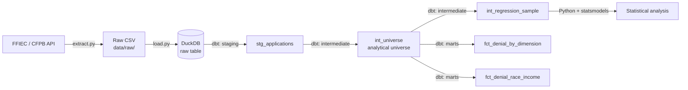

# HMDA Mortgage Denial Analysis

## Project Overview

This project looks at mortgage denial rates in North Carolina and asks how much of the racial gap in those rates comes from real financial reasons, and how much doesn't. I pulled loan-level records from the government's public HMDA dataset, loaded them into DuckDB, cleaned and modeled them with dbt, and ran a staged logistic regression in Python to answer the question.

Denial rates are different across racial groups. Some of that difference comes from things like income, how big the loan is compared to the home's value, and how much debt the applicant already has. So the real question is: once you control for those financial factors, how much of the gap is left?

The answer is most of it. Even after controlling for income, loan-to-value ratio, and debt-to-income ratio, Black applicants are still about 1.99 times more likely to be denied than White applicants with similar finances. Those financial factors only explain about 23% of the gap.

## Why This Project

Mortgage lending is a common industry where I live, and it's something I already had a connection to. My father worked in mortgage analysis, and he helped me understand what to actually look for in loan-level data, like which financial factors lenders care about and what a denial really means.

Because of that connection, I wanted this project to be more careful than a normal school project. I wanted the pipeline to be correct and the exclusions to be clear.

## Architecture

The pipeline has five stages:

1. **Extract** (`extract.py`) - pulls the raw loan file from the FFIEC/CFPB API and saves it to `data/raw/`.
2. **Load** (`load.py`) - reads that raw file into DuckDB as-is, with no cleaning.
3. **Staging** (`stg_applications`) - casts fields to the right types and fixes column names, but doesn't drop any rows.
4. **Analytical universe** (`int_universe`, `int_regression_sample`) - applies the exclusions that define which applications belong in the analysis, plus a further-narrowed sample used specifically for the regression.
5. **Marts and analysis** - `fct_denial_by_dimension` and `fct_denial_race_income` are denial-rate rollups built from `int_universe`; the regression itself (`analysis/denial_model.py`) reads `int_regression_sample` and runs the staged logistic regression in Python.

`run.py` runs stages 1 through 4 in order: extract, load, then `dbt build`. The regression is a separate step, since it's the actual analysis rather than part of the data pipeline.

## Data

Source: 2025 Home Mortgage Disclosure Act (HMDA) data, North Carolina, from the FFIEC / CFPB public dataset (ffiec.cfpb.gov).
Observation: one row per mortgage application.
Volume: 552,230 records as of this pipeline run (CFPB revises the public extract periodically, so re-running the pipeline will produce a slightly different count).
Analysis universe: 252,845 decisioned applications after exclusions. The regression itself uses a further-narrowed, complete-case sample of 176,366 applications (see Methodology).

## Methodology

### Exclusions

The raw file includes records that cannot be included for a true denial analysis. For example, withdrawn applications, incomplete files, purchased loans, and rows missing the financial fields such as income that the analysis depends on. Each is applied as an explicit step, reducing the dataset from 552,230 records to 252,845 decisioned applications.

### Staged Logistic Regression

Denial is modeled as a function of applicant race, then financial controls are layered in stage by stage: income, loan-to-value ratio (LTV), and debt-to-income ratio (DTI). This shows how much of the raw gap between races each control absorbs, and how much is remaining at the end.

## Findings

- 19.3% overall denial rate across decisioned applications.

- Financial controls (income, DTI, LTV) account for only ~23% of the raw Black-White denial gap.

- A 1.993x adjusted odds disparity remains after controls (95% CI 1.922-2.065).

This model quantifies an association that survives the financial controls available in the HMDA dataset. However, it does not identify the cause for the discrepancy in denial rates and should not be interpreted as evidence of discrimination alone. Credit score and underwriting detail are absent in the public data, which could be large contributors to the gap.

## Tech Stack

- Python - data extract, cleaning, analysis
- SQL (DuckDB) - filtering and exclusion pipeline
- statsmodels - logistic regression and confidence intervals

## Limitations and next steps

- Missing underwriting variables: HMDA omits credit score and underwriting data.

- Single state: Currently North Carolina only. Planned future work includes scaling the pipeline with dbt and a data warehouse to support multi-state analyses.
